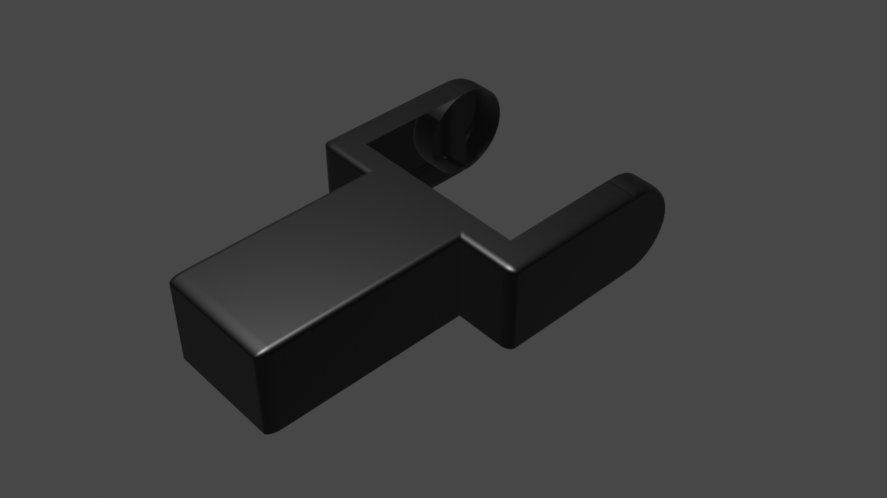

# proyecto-modelado3d-amayorga27
proyecto-modelado3d-amayorga27 created by GitHub Classroom

Para comenzar este proyecto me basé en el robot que realicé para la asignatura de *Mecatrónica*. Este robot lo llamamos **Crawll-e** y está compuesto de 4 piezas diferentes.

La primera pieza por la que comencé es la punta de la pata o el brazo.

---

A continuación modelé el antebrazo, que al igual que la anterior es simétrica para ambos brazos.

En el robot real, el antebrazo si que son piezas invertidas ya que hay que introducir el motor dentro.

---

Continuamos por la base, compuesta a su vez por dos **hombros** (invertidos) y por una **rueda trasera** de apoyo.

---

Finalmente tenemos la carcasa, con dos huecos para los ojos, aunque en este diseño, para darle color y el efecto del ultrasonidos que posee en la realidad, se le han diseñado unas *pupilas*

Quedando de la siguiente manera nuestro robot:
